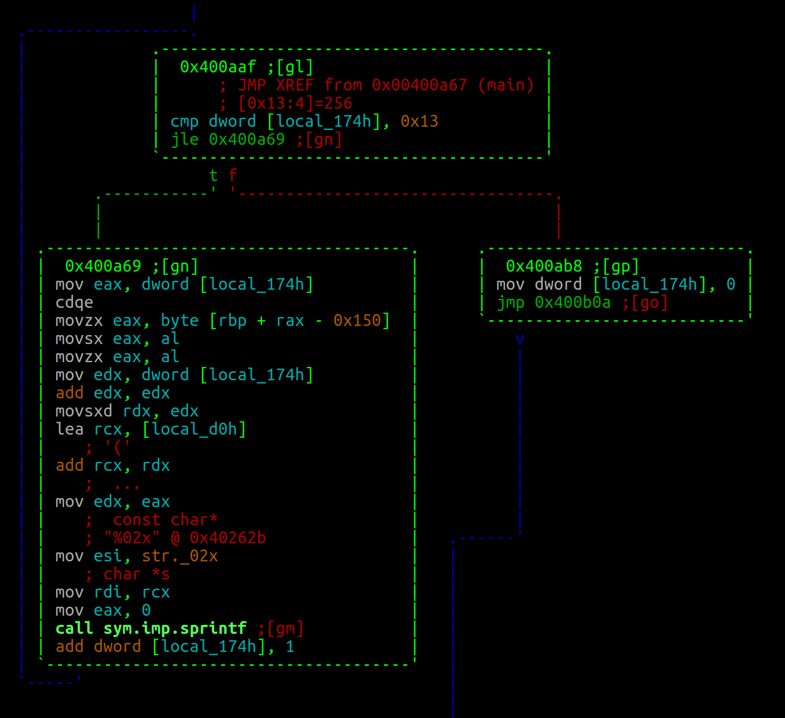
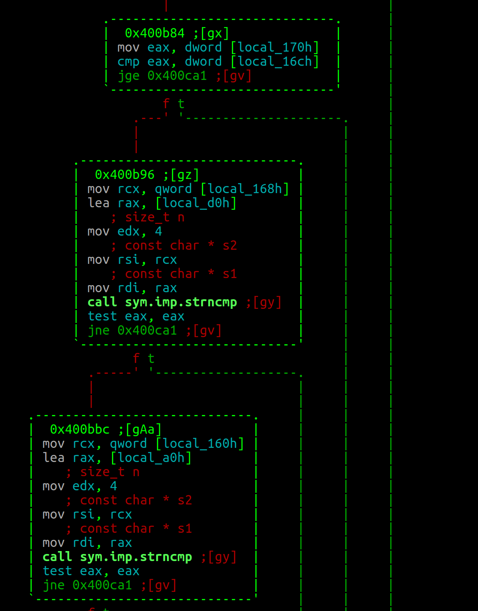

# ABC (Reversing)

File: [abc](abc)

I began this challenge by running file and strings. I discovered it was a 64-bit x86 binary and saw the following interesting strings.

```
give me flag... :D
%02x
69fc8b9b1cdfe47e6b51a6804fc1dbddba1ea1d9
gj, you got the flag:
ASIS{%s}
Sorry, try harder :(
```

This made me think at first Angr might be able to solve this quickly without doing any reverse engineering. I ran the program to find out it expected a single argument. Brandon and I attempted using Angr but unfortunately we were unable to solve it that way. I also tried to use online tools to crack the SHA1 hash I found in strings. It did not work either (I should have tried hashcat). So I opened up Radare and GDB since I didn't have access to IDA.
```
> r2 -AAA ./abc
> afl
> VV@main
```
The first thing that I thought was interesting was the following code block at 0x4008ba. There were three mallocs and three memsets. Lets call the first heap address A the second B and the third C. If you look at the code block you will notice that the middle 6 bytes of your argv[1] input is copied into B and that the first four bytes are copied into A and the last 4 bytes are copied into C. We also see there is a total of 12 bytes and that A and C are used as input to strtol with a base of 16. This made me think the first 4 bytes and the last 4 bytes are hex. Finally A,B and C are sent as arguments to 0x004024df. Let's ignore that function for now. We see that there are three loops that look like the following:


So it definitely looks like we are writing something as a hex string. Like I said there are three of these. After further analysis we see that the output of unknown function 0004024df is written as a hex string. At this point I figured it was a sha1 hash. I confirmed this in GDB.
```
gdb -q ./abc
break *0x400ab8
r "AAAAAAAAAAAA"
c
x/s $rbp-0xd0
"fb2f85c88567f3c8ce9b799c7c54642d0c7b41f6"
echo -n "ABCD" | sha1sum
"fb2f85c88567f3c8ce9b799c7c54642d0c7b41f6"
```
If you do this for the other two similar loops you will see B is hashed and C is hashed. I was unable to find any other hex strings in memory using gdb-peda strings. I thought that would be an easy way to see if the hash of the flag was stored in memory I did find that B needed to hash to "69fc8b9b1cdfe47e6b51a6804fc1dbddba1ea1d9"

I was unsuccessful in cracking that hash earlier so I looked for some more hints. I found the following.


If you look at my [notes](notes) you will see I wrote down what local variables equaled what. So I saw from the above comparisons that the first 4 bytes strtol value needed to be less than the last 4 bytes strtol value. Also, I saw the first A's hash needed to start with the original 4 bytes. Then I saw the same was true for C. So, I decided to use python to see what 4 byte hex values' sha1 hash started with the original 4 bytes. There were only two ['57d9', 'b53a']. So we know the password now looks like the following:
```
57d9????b553a
```
So I assumed the middle 6 bytes 9????b were printable ascii so I brute-forced the middle 4 bytes using the known hash to get the final password (see [solve2.py](solve2.py)):
```
57d9:-*)b53a
```
Then I got the flag:
```
./abc "57d9:-*)b53a"
gj, you got the flag: ASIS{477408a4d4ad68aa7abdfd2be0e4717154497c42}
```
