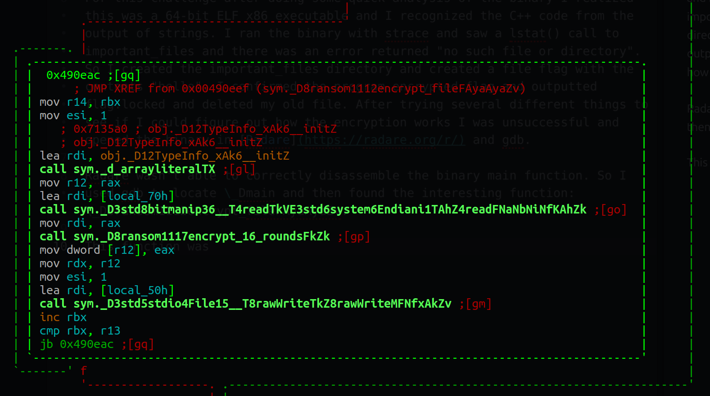
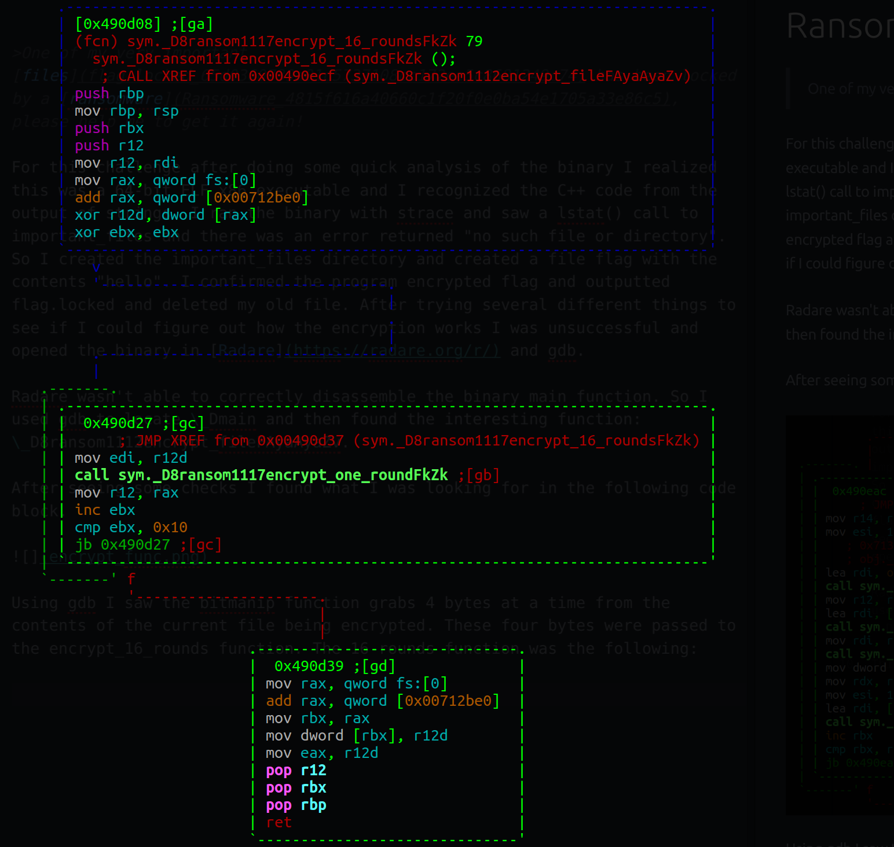
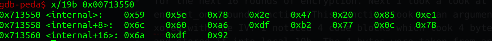
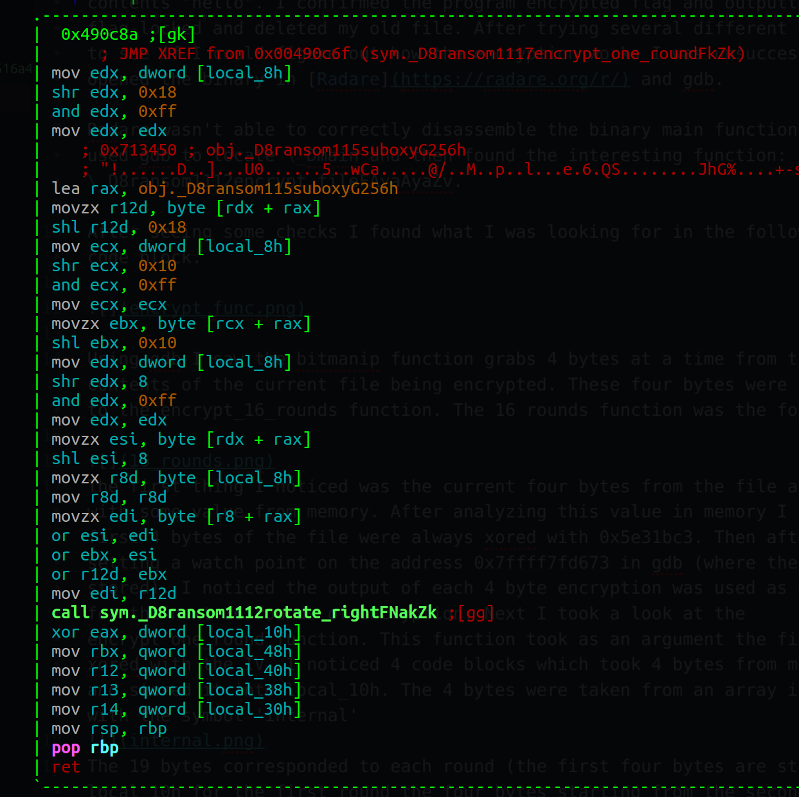
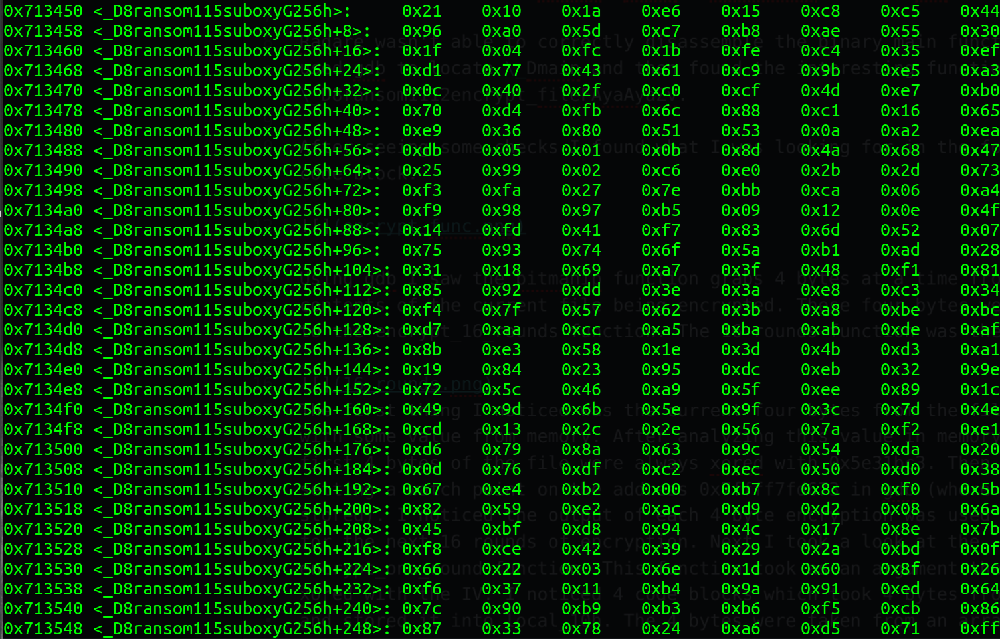

# Ransomware (Reversing 199 pts)

>One of my very important [files](flag.locked_65d0360739a01c5737108cc172ea5c8681249c74) has been locked by a [ransomware](Ransomware_4815f616a40660c1f20f0e0ba54e1705a33e86c5), please help me to get it again!

For this challenge after doing some quick analysis of the binary I realized this was a 64-bit ELF x86 executable and I recognized the C++ code from the output of strings. I ran the binary with strace and saw a lstat() call to important_files and there was an error returned "no such file or directory". So I created the important_files directory and created a file flag with the contents "hello". I confirmed the program encrypted flag and outputted flag.locked and deleted my old file. After trying several different things to see if I could figure out how the encryption works I was unsuccessful and opened the binary in [Radare](https://radare.org/r/) and gdb.

Radare wasn't able to correctly disassemble the binary main function. So I used gdb to locate \_Dmain and then found the interesting function: \_D8ransom1112encrypt_fileFAyaAyaZv.

After seeing some checks I found what I was looking for in the following code block.

Using gdb I saw the bitmanip function grabs 4 bytes at a time from the contents of the current file being encrypted. These four bytes were passed to the encrypt_16_rounds function. The 16 rounds function was the following:

The first thing I noticed was the current four bytes from the file are xored with some value from memory. After analyzing this value in memory I saw the first 4 bytes of the file were always xored with 0x5e31bc3. Then after setting a watch point on the address 0x7ffff7fd673 in gdb (where the IV was stored). I noticed the output of each 4 byte encryption was used as the IV for the next 16 rounds of encryption. Next I took a look at the encrypt_one_round function. This function took as an argument the file bytes xored with the IV. I noticed 4 code blocks which took 4 bytes from memory and stored it into local_10h. The 4 bytes were taken from an array in memory with the symbol 'internal'

The 19 bytes corresponded to each round (the first four bytes are stored in local_10h for the first round the four bytes starting from the second element (0x5e) was used for the next round and so on. This was used at the end of the following code block:

At this point I knew local_8h contained the argument to the one round function. This code block to each byte of the argument and used it as an index into an array in memory 'suboxy'

The resulting 4 bytes were then rotated right by one bit. Finally it is xored with local_10h and returned in the eax register. This encryption repeated 16 times and then the resulting encrypted value was passed in place of the IV for the next four bytes of data.

I then reversed the function in [python](solve.py) and was able to get the flag.

