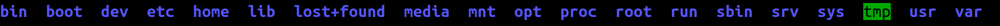

# Best Router (Forensics 200)

```
Best Router
http://forensics.chal.csaw.io:3287

NOTE: This will expand to ~16GB!
```

If we go to the website we see the following.


We were given an [archive](best_router.tar.gz) that expands to a 16GB file. After running file and strings I realized there were to many strings to go through but I did know we were dealing with a disk image of some kind the file command said I was dealing with a DOS/MBR boot sector. I decided to look at it in Gparted. Below is what I found.


So it looks like we have a boot partition and an ext4 file system. Lets see what we can get if we mount the filesystem.
```
sudo mount -o loop,ro,offset=48234496 best_router.img /mnt/tmp
ls /mnt/tmp
```


Looks like a Linux root directory. Lets see if we are lucky
```
find . -name flag* .
```
I found a flag.txt in the var/www/ directory. Unfortunately it was empty. So I looked to see what else was in the var/www directory and I found password.txt and username.txt. The username was admin and the password was iforgotaboutthemathtest. Using these credentials to login to the given website gave us the flag.
